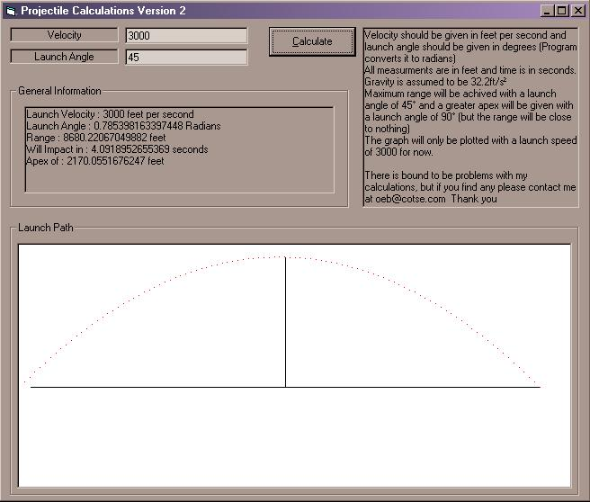



## Projectile Physics \(useful for games\)

### Description

The program is demonstrating a module I wrote for calculating things about a projectile (For example a mortar) it gives things like the range, the time till impact and it graphs the flight path. Any questions of comments? post here

New version : fixed Gravity constants and set autoredraw on pic boxes to true ... thanks rick =D
 
### More Info
 

             |
---                |---
**Submitted On**   |2002-04-19 18:40:22
**By**             |[oeb](https://github.com/Planet-Source-Code/PSCIndex/blob/master/ByAuthor/oeb.md)
**Level**          |Intermediate
**User Rating**    |4.7 (14 globes from 3 users)
**Compatibility**  |VB 6\.0
**Category**       |[Math/ Dates](https://github.com/Planet-Source-Code/PSCIndex/blob/master/ByCategory/math-dates__1-37.md)
**World**          |[Visual Basic](https://github.com/Planet-Source-Code/PSCIndex/blob/master/ByWorld/visual-basic.md)
**Archive File**   |[Projectile736514192002\.zip](https://github.com/Planet-Source-Code/oeb-projectile-physics-useful-for-games__1-33936/archive/master.zip)

